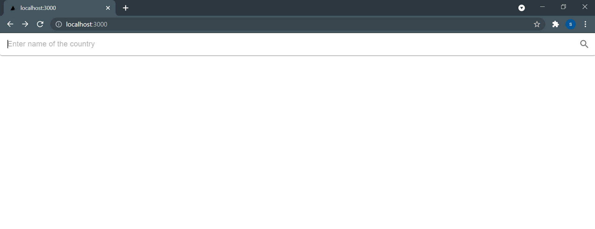
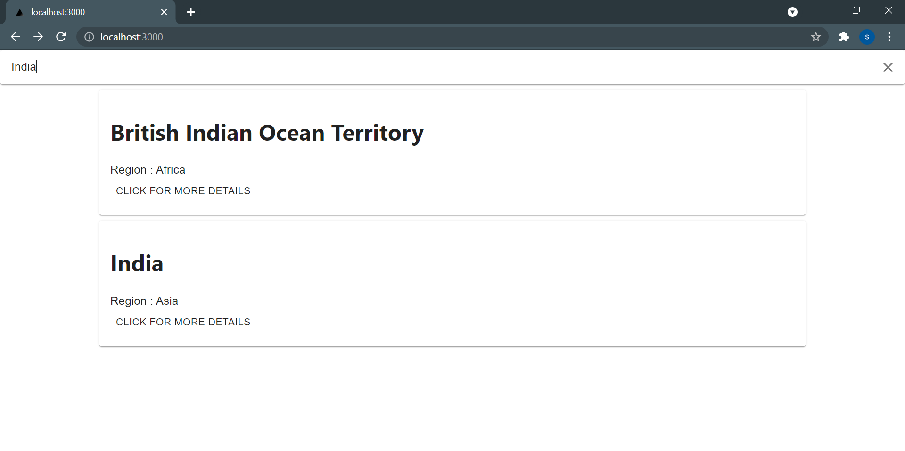
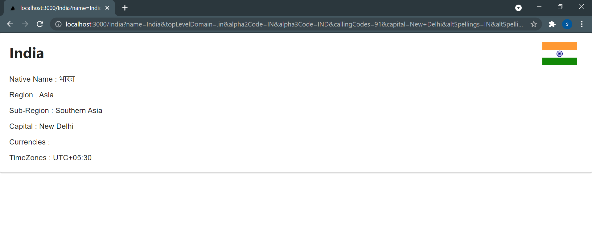

# Country-search
Search about any country.

To run the project on your localhost:

1. Download the files and run command “npm i” for node modules.
2. In your system run the command “npm run dev”.

Website Link: https://countries-search.herokuapp.com/

The user can search the country by its name:

The matching results appear in a list:

The user can further view more details about the country:

